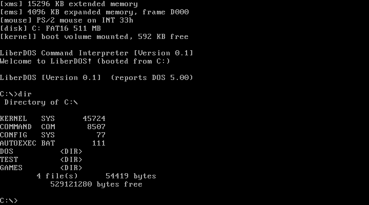

# LiberDOS

## Table of contents

- [**About**](#about)
- [**Screenshot**](#screenshot)
- [**Key features**](#key-features)
- [**Installation**](#installation)
- [**License**](#license)
- [**Contribution**](#contribution)
- [**Donations**](#donations)
- [**Star history**](#star-history)

## About

**LiberDOS** is a DOS-compatible operating system written from scratch in C and assembly. It is a small 16-bit real mode kernel with a broad DOS API that runs classic DOS software, including 32-bit titles that use DOS extenders.

## Screenshot

## Key features

### Broad DOS compatibility

- Wide coverage of the DOS programming interface (INT 21h and related services), so existing DOS programs run unmodified.
- Runs 16-bit .COM and .EXE programs as well as 32-bit protected mode software through DOS extenders.
- XMS 2.0 extended memory, EMS 4.0 expanded memory and a mouse driver are built into the kernel - no separate drivers needed.
- Small kernel footprint leaves over 600 KB of free conventional memory for applications.

### Storage

- Boots from a floppy disk or from a hard disk partition.
- FAT12 and FAT16 file systems with subdirectories, multiple drives and file sharing/locking.

### Command line shell

- Built-in command interpreter with the familiar DOS commands, batch file support, environment variables and PATH search.
- Standard utilities included: MORE, ATTRIB, CHKDSK.

### Portable development

- Builds on Windows and Linux using free tools: NASM and Open Watcom.
- Runs on the QEMU emulator out of the box and targets any 386+ PC.

## Installation

- For build and installation instructions follow [**this document**](./INSTALL.md).

## License

- This software is developed under the license called [**Unlicense**](./LICENSE).

## Contribution

If you are interested in contributing to the development of this project, we would love to hear from you! Developers can reach out to us through one of the contact methods listed on [**our contacts page**](https://libersoft.org/contacts). We prefer communication through our Telegram chat group, but feel free to use any method that suits you.
In addition to direct communication, you are welcome to contribute by submitting issues or pull requests on our project repository. Your insights and contributions are valuable to us. We look forward to collaborating with you!

## Donations

Donations are important to support the ongoing development and maintenance of our open source projects. Your contributions help us cover costs and support our team in improving our software. We appreciate any support you can offer.

To find out how to donate our projects, please navigate here:

Thank you for being a part of our projects' success!

## Star history

If you support our open source software, consider starring this repository. Thank you!

